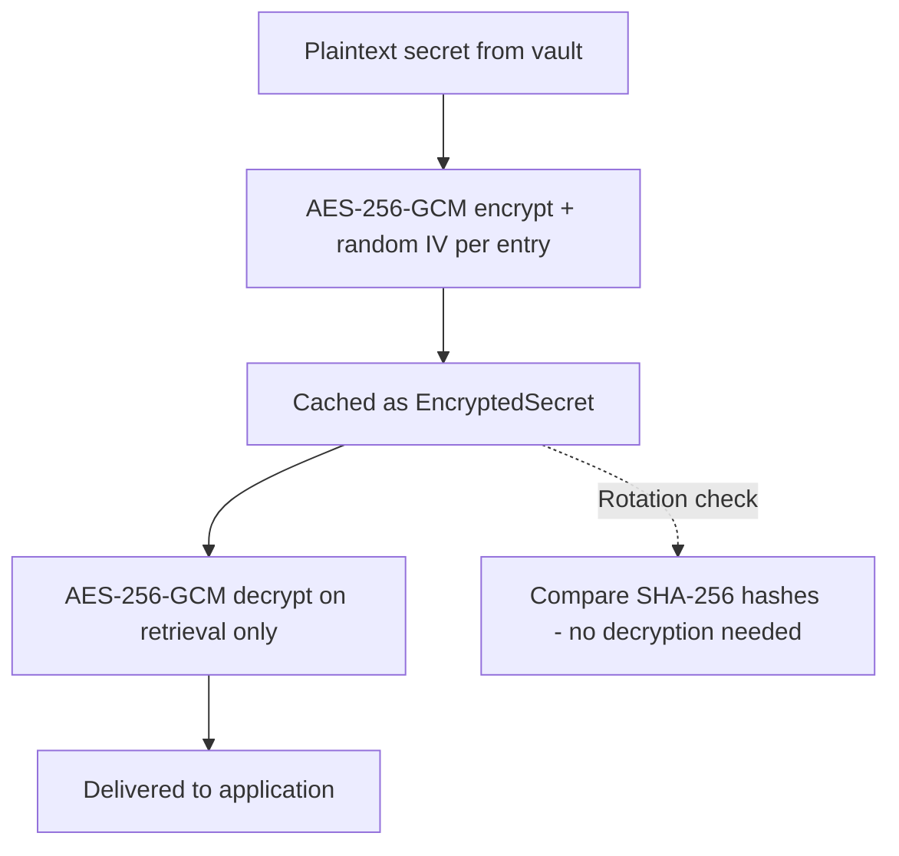

# 🔐 Secret Manager

**One library. Zero boilerplate. Any vault.**

A Spring Boot library that makes secret management invisible to developers.

[](https://openjdk.org/)
[](https://spring.io/projects/spring-boot)
[](LICENSE)
[](CONTRIBUTING.md)
[](CHANGELOG.md)

[Why?](#why-secret-manager) · [Quick Start](#quick-start) · [How It Works](#how-it-works) · [Architecture](#architecture) · [Docs](#documentation) · [Contributing](#contributing)

---

## The Vision

In the modern enterprise, **secrets are everywhere** — database passwords, API keys, encryption certificates, third-party tokens. They power every transaction, every login, every integration.

Yet most teams still manage them the hard way: scattered across environment variables, buried in config files, and coupled to a single vault vendor with fragile, hand-written glue code.

**Secret Manager** changes that. It's a Spring Boot library designed around one principle:

> *Application developers should never think about where secrets come from, how they're cached, or when they rotate.*

Drop it into your project, point it at your vault, and secrets simply *appear* — in your YAML configuration, in your Java fields, everywhere you need them. When a secret rotates in the vault, your application adapts automatically. No restart. No downtime. No boilerplate.

---

## Table of Contents

- [Why Secret Manager?](#why-secret-manager)
- [Quick Start](#quick-start)
- [How It Works](#how-it-works)
  - [Accessing Secrets](#accessing-secrets)
  - [Configuring Data Sources](#configuring-data-sources)
  - [Handling Rotation](#handling-rotation)
- [Architecture](#architecture)
  - [Module Overview](#module-overview)
  - [Plugin System](#plugin-system)
- [Security by Design](#security-by-design)
- [Running the Demo](#running-the-demo)
- [Configuration Reference](#configuration-reference)
- [Roadmap](#roadmap)
- [Documentation](#documentation)
- [Contributing](#contributing)
- [Project Structure](#project-structure)
- [Tech Stack](#tech-stack)
- [License](#license)

---

## Why Secret Manager?

Whether you're a **developer**, a **security engineer**, or an **engineering manager**, Secret Manager solves real, everyday problems:

| Challenge | The Old Way | With Secret Manager |
|:----------|:-----------|:-------------------|
| **Access secrets** | Custom code per vault SDK | `${secret://path}` or `@Secret` — one line |
| **Switch vaults** | Weeks of refactoring across services | Change one line in YAML |
| **Cache secrets safely** | DIY `ConcurrentHashMap` (often insecure) | AES-256-GCM encrypted cache with automatic TTL |
| **Detect rotation** | Manual polling scripts | Built-in detector with Spring events |
| **React to rotation** | Restart all pods | `@EventListener` — zero downtime |
| **Add a new vault** | Months of development | Implement one interface, drop a JAR |

**In plain terms:** your team stops writing infrastructure plumbing and starts shipping features. Security improves because secrets are encrypted in memory, rotated automatically, and never logged in plaintext.

---

## Quick Start

**1. Add the dependency** (Maven):

```xml
<dependency>
    <groupId>edu.m4z</groupId>
    <artifactId>secret-manager-core</artifactId>
    <version>1.0.0</version>
</dependency>
```

**2. Configure your vault** in `application.yml`:

```yaml
secrets:
  provider: conjur-vault                              # or: map-vault, mock-vault, ...
  conjur-vault:
    url: ${CONJUR_URL}
    account: ${CONJUR_ACCOUNT}
    authn-login: ${CONJUR_AUTHN_LOGIN}
    api-key: ${CONJUR_API_KEY}
```

**3. Use secrets anywhere** — in YAML or Java:

```yaml
spring:
  datasource:
    password: ${secret://database/prod/password}       # Resolved from your vault
```

```java
@Service
public class PaymentService {

    @Secret(path = "api/stripe/key")                   // Injected, encrypted in cache
    private String stripeApiKey;
}
```

**That's it.** No SDK boilerplate. No manual caching. No restart on rotation.

---

## How It Works

### Accessing Secrets

**Before** — Vault-specific SDK, no caching, no rotation:

```java
@Service
public class PaymentService {

    private String apiKey;
    private String apiSecret;
    private final ConjurClient conjurClient;
    private final ConcurrentHashMap<String, String> secretCache = new ConcurrentHashMap<>();

    public PaymentService() {
        // Manual Conjur setup — coupled to one vault SDK
        ConjurProperties props = new ConjurProperties();
        props.setUrl(System.getenv("CONJUR_URL"));
        props.setAccount(System.getenv("CONJUR_ACCOUNT"));
        props.setAuthnLogin(System.getenv("CONJUR_AUTHN_LOGIN"));
        props.setApiKey(System.getenv("CONJUR_API_KEY"));
        this.conjurClient = new ConjurClient(props);
        this.conjurClient.authenticate();
    }

    @PostConstruct
    public void init() {
        // Manual fetch — no encryption, no TTL, no rotation
        this.apiKey = fetchAndCache("api/external/key");
        this.apiSecret = fetchAndCache("api/external/secret");
    }

    private String fetchAndCache(String path) {
        return secretCache.computeIfAbsent(path, p -> {
            try {
                return conjurClient.retrieveSecret(p);    // Plaintext in memory!
            } catch (Exception e) {
                throw new RuntimeException("Failed to fetch secret: " + p, e);
            }
        });
    }

    // Want rotation? Write your own scheduled polling.
    // Want to switch to Azure Key Vault? Rewrite everything above.
}
```

**After** — Vault-agnostic. Encrypted cache. Rotation-ready:

```java
@Service
public class PaymentService {

    @Secret(path = "api/external/key")
    private String apiKey;

    @Secret(path = "api/external/secret")
    private String apiSecret;
}
```

---

### Configuring Data Sources

**Before** — Secrets hardcoded or manually fetched:

```java
@Configuration
public class DataSourceConfig {

    @Bean
    public DataSource dataSource() {
        HikariDataSource ds = new HikariDataSource();
        ds.setJdbcUrl(System.getenv("DB_URL"));               // From env var
        ds.setUsername(System.getenv("DB_USER"));              // From env var
        ds.setPassword(fetchFromVault("database/prod/pass"));  // Manual vault call
        return ds;
    }

    private String fetchFromVault(String path) {
        // 20+ lines of vault-specific code...
    }
}
```

**After** — Pure YAML, zero Java configuration:

```yaml
spring:
  datasource:
    url: ${secret://database/prod/url}
    username: ${secret://database/prod/username}
    password: ${secret://database/prod/password}
```

---

### Handling Rotation

**Before** — Custom scheduled task, manual cache invalidation:

```java
@Component
public class SecretRotationPoller {

    @Autowired private ConjurClient conjurClient;
    @Autowired private HikariDataSource dataSource;
    private final Map<String, String> lastKnownHashes = new ConcurrentHashMap<>();

    @Scheduled(fixedDelay = 300000)
    public void pollForChanges() {
        for (String path : lastKnownHashes.keySet()) {
            try {
                String current = conjurClient.retrieveSecret(path);
                String hash = DigestUtils.sha256Hex(current);
                if (!hash.equals(lastKnownHashes.get(path))) {
                    lastKnownHashes.put(path, hash);
                    if ("database/prod/password".equals(path)) {
                        dataSource.setPassword(current);
                        dataSource.getHikariPoolMXBean().softEvictConnections();
                    }
                    // else if... else if... else if...
                }
            } catch (Exception e) {
                log.error("Rotation check failed for: {}", path, e);
            }
        }
    }
}
```

**After** — Declarative, event-driven, decoupled:

```java
@Component
public class RotationHandler {

    @Autowired private DataSource dataSource;

    @EventListener
    public void onRotation(SecretRotationEvent event) {
        if ("database/prod/password".equals(event.getSecretPath())) {
            HikariDataSource hikari = (HikariDataSource) dataSource;
            hikari.setPassword(event.getNewValue());
            hikari.getHikariPoolMXBean().softEvictConnections();
        }
    }
}
```

---

## Architecture

```mermaid
graph TB
    subgraph Your Application
        YAML[application.yml]
        BEAN[@Secret annotation]
    end

    subgraph Secret Manager Core
        PP[PropertySource]
        AP[AnnotationProcessor]
        SM[SecretService]
        CACHE[SecretCache - SPI]
        ENC[EncryptionService - AES-256-GCM]
        RD[RotationDetector]
        EVT[SecretRotationEvent]
    end

    subgraph Vault Providers - SPI
        CONJUR[CyberArk Conjur]
        MAP[Map Vault]
        MOCK[Mock Vault]
        CUSTOM[Your Custom Provider]
    end

    YAML --> PP --> SM
    BEAN --> AP --> SM
    SM --> CACHE --> ENC
    SM --> CONJUR
    SM --> MAP
    SM --> MOCK
    SM --> CUSTOM
    RD --> SM
    RD --> EVT
```

### Module Overview

| Module | Artifact | Purpose |
|:-------|:---------|:--------|
| **core** | `secret-manager-core` | SPI interfaces, auto-configuration, `@Secret`, `${secret://}`, encryption, rotation detection |
| **memory-cache** | `secret-manager-memory-cache` | In-memory AES-encrypted cache via `ConcurrentHashMap` |
| **map-vault** | `secret-manager-map-vault` | Config-driven vault — secrets defined directly in YAML |
| **mock-vault** | `secret-manager-mock-vault` | Extends map-vault with `updateSecret()` for testing rotation |
| **conjur-vault** | `secret-manager-conjur` | CyberArk Conjur provider — pure Java `HttpClient`, zero SDK dependency |
| **demo** | `secret-manager-demo` | Full working application with JPA, HikariCP, rotation simulation, and REST API |

### Plugin System

Secret Manager uses **Java Service Provider Interface (SPI)** for zero-coupling extensibility. Adding a new vault or cache backend requires no changes to the core library — just implement an interface and drop a JAR.

**Example: Adding Azure Key Vault support**

```java
public class AzureKeyVaultProvider implements SecretVaultProvider {

    @Override
    public String getProviderName() { return "azure-keyvault"; }

    @Override
    public void initialize(ConfigurableEnvironment env) {
        // Read secrets.azure-keyvault.* properties
    }

    @Override
    public String getSecret(String path) throws SecretNotFoundException {
        // Call Azure Key Vault REST API
    }

    @Override
    public boolean isAvailable() { return true; }
}
```

Register it in `META-INF/services/edu.m4z.secrets.provider.SecretVaultProvider`:

```
com.yourcompany.vault.AzureKeyVaultProvider
```

Configure it:

```yaml
secrets:
  provider: azure-keyvault
```

That's it. No changes to the core library. No recompilation. Just a new JAR on the classpath.

> The same pattern applies to custom cache backends — implement `SecretCache`, register via SPI, and set `secrets.cache.type`.

---

## Security by Design

Secret Manager was built with banking-grade security requirements in mind:



| Protection | How |
|:-----------|:----|
| **Secrets never stored in plaintext** | AES-256-GCM encryption with a unique initialization vector per cache entry |
| **Rotation detection without decryption** | SHA-256 hash comparison — the encrypted value is never touched |
| **Master key from environment** | Never hardcoded; sourced from environment variables |
| **Time-limited cache** | TTL-based automatic eviction prevents stale secrets |
| **No secret logging** | All secret values are masked in log output |

---

## Running the Demo

```bash
# Build all modules
mvn clean install

# Run the demo application
cd demo
mvn spring-boot:run
```

### Demo Endpoints

| Endpoint | Method | Description |
|:---------|:-------|:------------|
| `/api/demo/health` | GET | Vault and cache health check |
| `/api/demo/cache/stats` | GET | Cache size and stored keys |
| `/api/demo/config` | GET | Current API configuration |
| `/api/demo/payment?amount=100` | POST | Process a test payment |
| `/api/demo/rotate-secret` | POST | Simulate a secret rotation |
| `/api/demo/clear-cache` | DELETE | Clear the secret cache |

### Try Secret Rotation

```bash
# 1. Rotate a secret
curl -X POST http://localhost:8080/api/demo/rotate-secret \
  -H "Content-Type: application/json" \
  -d '{"path":"database/prod/password","newValue":"new-password-789"}'

# 2. Watch the logs — rotation detected within 30 seconds
# [INFO] SECRET ROTATION DETECTED!
# [INFO] Path: database/prod/password
# [INFO] Database password updated and connections evicted
```

---

## Configuration Reference

### Core Properties

| Property | Default | Description |
|:---------|:--------|:------------|
| `secrets.enabled` | `true` | Master switch to enable/disable the library |
| `secrets.provider` | `conjur-vault` | Vault provider name (must match `getProviderName()`) |
| `secrets.encryption.key` | *auto-generated* | Base64-encoded AES-256 key — **set explicitly in production** |
| `secrets.cache.type` | `memory` | Cache backend type (must match `getType()`) |
| `secrets.cache.default-ttl` | `3600` | Cache time-to-live in seconds (`-1` = no expiry) |
| `secrets.rotation-detection.enabled` | `true` | Enable automatic rotation polling |
| `secrets.rotation-detection.check-interval` | `300000` | Polling interval in milliseconds (default: 5 minutes) |

### CyberArk Conjur

| Property | Description |
|:---------|:------------|
| `secrets.conjur-vault.url` | Conjur server URL |
| `secrets.conjur-vault.account` | Account name |
| `secrets.conjur-vault.authn-login` | Authentication identity (e.g. `host/app-name`) |
| `secrets.conjur-vault.api-key` | API key (**use an environment variable**) |
| `secrets.conjur-vault.ssl-verify` | Verify SSL certificates (default: `true`) |

### Map Vault (for development)

```yaml
secrets:
  provider: map-vault
  map-vault:
    entry-set:
      - key: "database/prod/password"
        value: "my-secret"
      - key: "api/stripe/key"
        value: "sk_live_xxx"
```

### Mock Vault (for testing)

```yaml
secrets:
  provider: mock-vault
  mock-vault:
    entry-set:
      - key: "database/prod/password"
        value: "my-secret"
```

> For full configuration details, see [docs/configuration.md](docs/configuration.md).

---

## Roadmap

- [ ] **Redis cache** — `secret-manager-redis-cache` for distributed encrypted caching
- [ ] **HashiCorp Vault** provider
- [ ] **Azure Key Vault** provider
- [ ] **AWS Secrets Manager** provider
- [ ] **Spring Boot Actuator** endpoint for cache monitoring
- [ ] **Micrometer metrics** — cache hits/misses, vault latency, rotation count
- [ ] Migrate off deprecated `EnvironmentPostProcessor` API

Have an idea? [Open an issue](https://github.com/your-org/secret-manager/issues) or read our [Contributing Guide](CONTRIBUTING.md).

---

## Documentation

| Document | Description |
|:---------|:------------|
| [Architecture Guide](docs/architecture.md) | Deep dive into the module structure, SPI design, and data flow |
| [Configuration Guide](docs/configuration.md) | Complete reference for all properties and vault providers |
| [Security Model](docs/security.md) | Encryption, key management, rotation detection, and threat model |
| [Writing a Custom Provider](docs/custom-provider.md) | Step-by-step guide to building your own vault or cache plugin |
| [FAQ](docs/faq.md) | Common questions, troubleshooting, and tips |
| [Changelog](CHANGELOG.md) | Version history following [Keep a Changelog](https://keepachangelog.com/) |

---

## Contributing

We welcome contributions of all kinds — from bug reports to new vault providers.

1. Read the [Contributing Guide](CONTRIBUTING.md)
2. Check existing [issues](https://github.com/your-org/secret-manager/issues) or open a new one
3. Fork, branch, code, test, and submit a pull request

Please review our [Security Policy](SECURITY.md) for reporting vulnerabilities responsibly.

---

## Author

**Mehrez Ben Salem** — Software Architect · 26 years in software engineering

Built with the conviction that infrastructure concerns like secret management should be **invisible** to application developers.

---

## License

This project is licensed under the [MIT License](LICENSE) — use it, fork it, ship it.

---

## Project Structure

```
secret-manager/
├── README.md
├── CONTRIBUTING.md
├── SECURITY.md
├── CHANGELOG.md
├── LICENSE
├── pom.xml
├── docs/
│   ├── architecture.md
│   ├── configuration.md
│   ├── security.md
│   ├── custom-provider.md
│   └── faq.md
├── core/                              # secret-manager-core
│   └── src/main/java/edu/m4z/secrets/
│       ├── annotation/                # @Secret
│       ├── autoconfigure/             # EnvironmentPostProcessor, AutoConfiguration
│       ├── cache/                     # SecretCache SPI, EncryptedSecret
│       ├── config/                    # SecretsProperties
│       ├── encryption/                # AES-256-GCM service
│       ├── event/                     # SecretRotationEvent
│       ├── exception/                 # Exception hierarchy
│       ├── processor/                 # PropertySource, AnnotationProcessor
│       ├── provider/                  # SecretVaultProvider SPI
│       └── rotation/                  # RotationDetector
├── memory-cache/                      # InMemorySecretCache
├── map-vault/                         # MapVaultProvider
├── mock-vault/                        # MockVaultProvider
├── conjur-vault/                      # CyberArk Conjur (pure Java HTTP)
└── demo/                              # Full demo application
```

## Tech Stack

| Component | Technology |
|:----------|:----------|
| Runtime | Java 21, Spring Boot 4.0.2, Spring Framework 7.0 |
| Encryption | AES-256-GCM (authenticated encryption) |
| Hashing | SHA-256 (rotation detection) |
| Plugin system | Java ServiceLoader (SPI) |
| HTTP client | `java.net.http.HttpClient` (Conjur — zero external dependencies) |
| Build | Maven multi-module |
