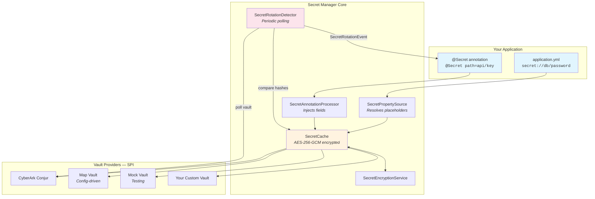
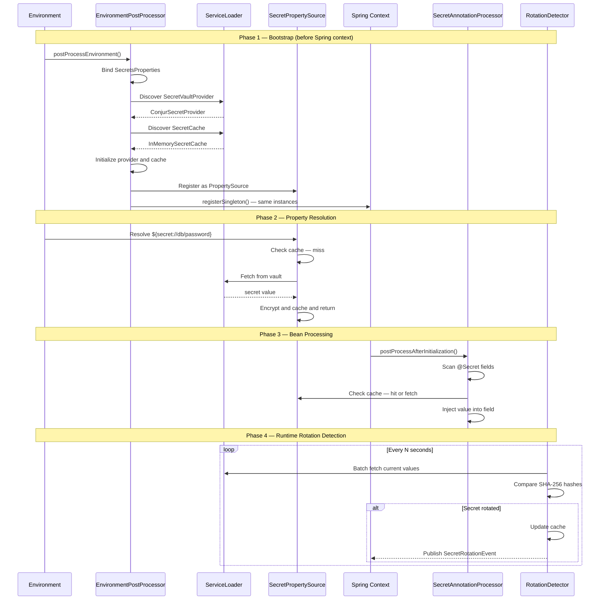
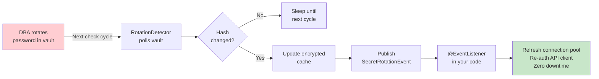
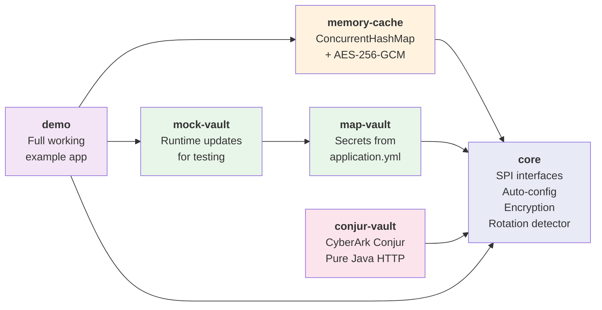
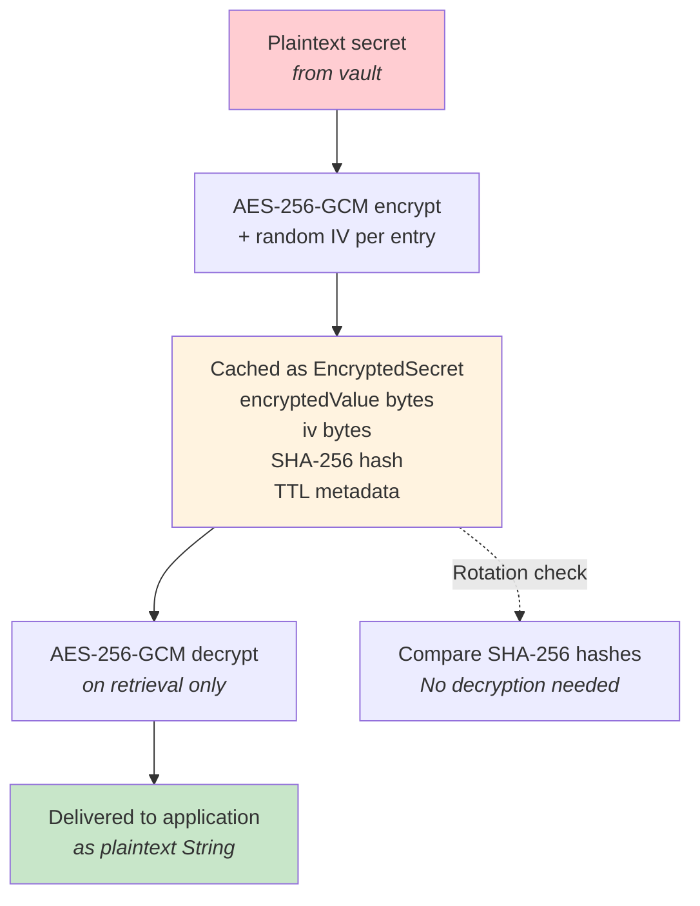

# 🔐 Secret Manager — Spring Boot Starter

**Stop hardcoding secrets. Stop writing boilerplate. Start rotating automatically.**

[](https://openjdk.org/)
[](https://spring.io/projects/spring-boot)
[](LICENSE)

---

## The Problem

Every enterprise team building on Spring Boot faces the same pain:

🔴 **Secrets are scattered** — database passwords in environment variables, API keys in config files, certificates mounted as volumes. No unified access pattern.

🔴 **Rotation is terrifying** — when a DBA rotates a database password, who restarts the pods? How do you know the new credential propagated? Did the connection pool pick it up, or is production silently failing?

🔴 **Caching is DIY** — you fetch a secret from Conjur or Vault, then what? Store it in a `static String`? Every team reinvents the wheel, often insecurely.

🔴 **Switching vaults is a rewrite** — migrating from HashiCorp Vault to CyberArk Conjur? That's weeks of refactoring across dozens of microservices.

---

## Before / After

### Accessing secrets

❌ **Before** — 47 lines of boilerplate per service, vault-specific SDK, no caching, no rotation:

```java
@Service
public class PaymentService {

    private String apiKey;
    private String apiSecret;
    private final ConjurClient conjurClient;
    private final ConcurrentHashMap<String, String> secretCache = new ConcurrentHashMap<>();

    public PaymentService() {
        // Manual Conjur setup — coupled to one vault SDK
        ConjurProperties props = new ConjurProperties();
        props.setUrl(System.getenv("CONJUR_URL"));
        props.setAccount(System.getenv("CONJUR_ACCOUNT"));
        props.setAuthnLogin(System.getenv("CONJUR_AUTHN_LOGIN"));
        props.setApiKey(System.getenv("CONJUR_API_KEY"));
        this.conjurClient = new ConjurClient(props);
        this.conjurClient.authenticate();
    }

    @PostConstruct
    public void init() {
        // Manual fetch — no encryption, no TTL, no rotation
        this.apiKey = fetchAndCache("api/external/key");
        this.apiSecret = fetchAndCache("api/external/secret");
    }

    private String fetchAndCache(String path) {
        return secretCache.computeIfAbsent(path, p -> {
            try {
                return conjurClient.retrieveSecret(p);    // Plaintext in memory!
            } catch (Exception e) {
                throw new RuntimeException("Failed to fetch secret: " + p, e);
            }
        });
    }

    // Want rotation? Write your own scheduled polling.
    // Want to switch to Azure Key Vault? Rewrite everything above.
}
```

✅ **After** — 8 lines. Vault-agnostic. Encrypted cache. Rotation-ready:

```java
@Service
public class PaymentService {

    @Secret(path = "api/external/key")
    private String apiKey;

    @Secret(path = "api/external/secret")
    private String apiSecret;
}
```

---

### Configuring datasources

❌ **Before** — secrets hardcoded or fetched manually in a `@Configuration` class:

```java
@Configuration
public class DataSourceConfig {

    @Bean
    public DataSource dataSource() {
        HikariDataSource ds = new HikariDataSource();
        ds.setJdbcUrl(System.getenv("DB_URL"));               // From env var
        ds.setUsername(System.getenv("DB_USER"));              // From env var
        ds.setPassword(fetchFromVault("database/prod/pass"));  // Manual vault call
        return ds;
    }

    private String fetchFromVault(String path) {
        // 20+ lines of vault-specific code...
    }
}
```

✅ **After** — pure YAML, zero Java config:

```yaml
spring:
  datasource:
    url: ${secret://database/prod/url}
    username: ${secret://database/prod/username}
    password: ${secret://database/prod/password}
```

---

### Handling rotation

❌ **Before** — custom scheduled task, manual cache invalidation, fragile wiring:

```java
@Component
public class SecretRotationPoller {

    @Autowired private ConjurClient conjurClient;
    @Autowired private HikariDataSource dataSource;
    private final Map<String, String> lastKnownHashes = new ConcurrentHashMap<>();

    @Scheduled(fixedDelay = 300000)
    public void pollForChanges() {
        for (String path : lastKnownHashes.keySet()) {
            try {
                String current = conjurClient.retrieveSecret(path);
                String hash = DigestUtils.sha256Hex(current);
                if (!hash.equals(lastKnownHashes.get(path))) {
                    lastKnownHashes.put(path, hash);
                    // Now what? Manual if/else chain for every secret...
                    if ("database/prod/password".equals(path)) {
                        dataSource.setPassword(current);
                        dataSource.getHikariPoolMXBean().softEvictConnections();
                    }
                    // else if... else if... else if...
                }
            } catch (Exception e) {
                log.error("Rotation check failed for: {}", path, e);
            }
        }
    }
}
```

✅ **After** — declarative, event-driven, decoupled:

```java
@Component
public class RotationHandler {

    @Autowired private DataSource dataSource;

    @EventListener
    public void onRotation(SecretRotationEvent event) {
        if ("database/prod/password".equals(event.getSecretPath())) {
            HikariDataSource hikari = (HikariDataSource) dataSource;
            hikari.setPassword(event.getNewValue());
            hikari.getHikariPoolMXBean().softEvictConnections();
        }
    }
}
```

Rotation detection, hash comparison, cache updates — all handled by the library.

---

## The Solution

**Secret Manager** is a Spring Boot starter that makes secrets a first-class citizen in your application. One library. Zero boilerplate. Any vault.

```yaml
spring:
  datasource:
    password: ${secret://database/prod/password}   # ← That's it. Resolved from your vault.
```

```java
@Service
public class PaymentService {
    
    @Secret(path = "api/stripe/key")               // ← Injected at startup. Encrypted in cache.
    private String stripeApiKey;
}
```

When the secret rotates in the vault, your app **detects it automatically** and fires a Spring event. Your connection pool refreshes. Your API client re-authenticates. **No restart. No downtime.**

---

## Why Secret Manager?

| Challenge | Without Secret Manager | With Secret Manager |
|-----------|----------------------|-------------------|
| Access secrets | Custom code per vault SDK | `${secret://path}` or `@Secret` |
| Switch vaults | Rewrite integration layer | Change one line in YAML |
| Cache secrets | DIY `ConcurrentHashMap` | AES-256-GCM encrypted cache, automatic TTL |
| Detect rotation | Manual polling scripts | Built-in detector + Spring events |
| React to rotation | Restart pods | `@EventListener` — zero downtime |
| New vault provider | Months of development | Implement one interface, drop a JAR |

---

## Architecture



---

## How It Works

### Bootstrap → Runtime Lifecycle



### Secret Rotation Flow



---

## Quick Start

### 1. Add Dependencies

```xml
<!-- Core + cache + your vault provider -->
<dependency>
    <groupId>edu.m4z</groupId>
    <artifactId>secret-manager-core</artifactId>
    <version>1.0.0-SNAPSHOT</version>
</dependency>

<dependency>
    <groupId>edu.m4z</groupId>
    <artifactId>secret-manager-memory-cache</artifactId>
    <version>1.0.0-SNAPSHOT</version>
</dependency>

<!-- Pick ONE vault provider -->
<dependency>
    <groupId>edu.m4z</groupId>
    <artifactId>secret-manager-conjur</artifactId>
    <version>1.0.0-SNAPSHOT</version>
</dependency>
```

### 2. Configure

```yaml
secrets:
  enabled: true
  provider: conjur-vault

  encryption:
    key: ${MASTER_ENCRYPTION_KEY}     # Base64 AES-256 key

  cache:
    type: memory
    default-ttl: 3600                  # 1 hour

  rotation-detection:
    enabled: true
    check-interval: 300000             # 5 minutes

  conjur-vault:
    url: ${CONJUR_URL}
    account: ${CONJUR_ACCOUNT}
    authn-login: ${CONJUR_AUTHN_LOGIN}
    api-key: ${CONJUR_API_KEY}
```

### 3. Use Secrets — Two Ways

**In configuration files:**

```yaml
spring:
  datasource:
    url: ${secret://database/prod/url}
    username: ${secret://database/prod/username}
    password: ${secret://database/prod/password}
```

Supports defaults: `${secret://path:fallback-value}`

**In code:**

```java
@Service
public class PaymentService {

    @Secret(path = "api/stripe/key")
    private String stripeKey;

    @Secret(path = "api/stripe/secret")
    private String stripeSecret;

    @Secret(path = "app/feature-flag", defaultValue = "false", required = false)
    private String featureFlag;
}
```

### 4. React to Rotation

```java
@Component
@RequiredArgsConstructor
public class SecretRotationHandler {

    private final DataSource dataSource;

    @EventListener
    public void onRotation(SecretRotationEvent event) {
        if ("database/prod/password".equals(event.getSecretPath())) {
            HikariDataSource hikari = (HikariDataSource) dataSource;
            hikari.setPassword(event.getNewValue());
            hikari.getHikariPoolMXBean().softEvictConnections();
            // Connection pool refreshed. Zero downtime.
        }
    }
}
```

---

## Modules



| Module | Artifact | What it does |
|--------|----------|-------------|
| **core** | `secret-manager-core` | SPI interfaces, auto-configuration, `@Secret`, `${secret://}`, encryption, rotation detection |
| **memory-cache** | `secret-manager-memory-cache` | In-memory encrypted cache via `ConcurrentHashMap` |
| **map-vault** | `secret-manager-map-vault` | Config-driven vault — secrets defined in YAML |
| **mock-vault** | `secret-manager-mock-vault` | Extends map-vault with `updateSecret()` for testing rotation |
| **conjur-vault** | `secret-manager-conjur` | CyberArk Conjur — pure Java `HttpClient`, zero SDK dependency |
| **demo** | `secret-manager-demo` | Full application: JPA, HikariCP, rotation simulation, REST API |

---

## Plugin Architecture

Secret Manager uses **Java ServiceLoader (SPI)** for zero-coupling extensibility. No `@Component`, no classpath scanning — just drop a JAR and configure.

### Create a Custom Vault Provider

```java
public class AzureKeyVaultProvider implements SecretVaultProvider {

    @Override
    public String getProviderName() { return "azure-keyvault"; }

    @Override
    public void initialize(ConfigurableEnvironment env) {
        // Read secrets.azure-keyvault.* from environment
    }

    @Override
    public String getSecret(String path) throws SecretNotFoundException {
        // Call Azure Key Vault REST API
    }

    @Override
    public boolean isAvailable() { return true; }
}
```

Register in `META-INF/services/edu.m4z.secrets.provider.SecretVaultProvider`:

```
com.yourcompany.vault.AzureKeyVaultProvider
```

Configure:

```yaml
secrets:
  provider: azure-keyvault
```

**That's it.** No changes to the core library. No recompilation. Just a new JAR on the classpath.

### Create a Custom Cache

Same pattern — implement `SecretCache`, register in `META-INF/services/edu.m4z.secrets.cache.SecretCache`, set `secrets.cache.type`.

---

## Security Design



- **Secrets never stored in plaintext** — AES-256-GCM with unique IV per entry
- **Rotation detection without decryption** — SHA-256 hash comparison only
- **Master key from environment** — never hardcoded, supports env variables
- **TTL-based expiration** — secrets auto-evict from cache
- **No secret logging** — values are masked in all log output

---

## Running the Demo

```bash
# Build everything
mvn clean install -Dmaven.test.skip=true

# Run demo
cd demo
mvn spring-boot:run
```

### Demo Endpoints

| Endpoint | Method | Description |
|----------|--------|-------------|
| `/api/demo/health` | GET | Vault and cache health |
| `/api/demo/cache/stats` | GET | Cache size and keys |
| `/api/demo/config` | GET | Current API configuration |
| `/api/demo/payment?amount=100` | POST | Process test payment |
| `/api/demo/rotate-secret` | POST | Simulate secret rotation |
| `/api/demo/clear-cache` | DELETE | Clear the cache |

### Simulate Rotation

```bash
# 1. Rotate a secret
curl -X POST http://localhost:8080/api/demo/rotate-secret \
  -H "Content-Type: application/json" \
  -d '{"path":"database/prod/password","newValue":"new-password-789"}'

# 2. Watch the logs — rotation detected within 30 seconds (demo interval)
# [INFO] SECRET ROTATION DETECTED!
# [INFO] Path: database/prod/password
# [INFO] Database password updated and connections evicted
```

---

## Configuration Reference

### Core Properties

| Property | Default | Description |
|----------|---------|-------------|
| `secrets.enabled` | `true` | Master switch |
| `secrets.provider` | `conjur-vault` | Vault provider name (must match `getProviderName()`) |
| `secrets.encryption.key` | *auto-generated* | Base64-encoded AES-256 key. **Set in production!** |
| `secrets.cache.type` | `memory` | Cache type (must match `getType()`) |
| `secrets.cache.default-ttl` | `3600` | Cache TTL in seconds. `-1` = no expiry |
| `secrets.rotation-detection.enabled` | `true` | Enable rotation polling |
| `secrets.rotation-detection.check-interval` | `300000` | Poll interval in milliseconds |

### CyberArk Conjur

| Property | Description |
|----------|-------------|
| `secrets.conjur-vault.url` | Conjur server URL |
| `secrets.conjur-vault.account` | Account name |
| `secrets.conjur-vault.authn-login` | Authentication identity (`host/app-name`) |
| `secrets.conjur-vault.api-key` | API key (use env variable) |
| `secrets.conjur-vault.ssl-verify` | Verify SSL certs (default: `true`) |

### Map Vault / Mock Vault

```yaml
secrets:
  provider: map-vault
  map-vault:
    entry-set:
      - key: "database/prod/password"
        value: "my-secret"
      - key: "api/stripe/key"
        value: "sk_live_xxx"
```

---

## Project Structure

```
secret-manager/
├── pom.xml                             # Parent POM
├── core/                               # secret-manager-core
│   └── src/main/java/edu/m4z/secrets/
│       ├── annotation/                 # @Secret
│       ├── autoconfigure/              # EnvironmentPostProcessor, AutoConfiguration
│       ├── cache/                      # SecretCache SPI, EncryptedSecret
│       ├── config/                     # SecretsProperties
│       ├── encryption/                 # AES-256-GCM service
│       ├── event/                      # SecretRotationEvent
│       ├── exception/                  # Exception hierarchy
│       ├── processor/                  # PropertySource, AnnotationProcessor
│       ├── provider/                   # SecretVaultProvider SPI
│       └── rotation/                   # RotationDetector
├── memory-cache/                       # InMemorySecretCache
├── map-vault/                          # MapVaultProvider
├── mock-vault/                         # MockVaultProvider
├── conjur-vault/                       # CyberArk Conjur (pure Java HTTP)
└── demo/                               # Full demo application
```

---

## Tech Stack

| Component | Technology |
|-----------|-----------|
| Runtime | Java 21, Spring Boot 4.0.2, Spring Framework 7.0 |
| Encryption | AES-256-GCM (authenticated encryption) |
| Hashing | SHA-256 (rotation detection) |
| Plugin system | Java ServiceLoader (SPI) |
| HTTP client | `java.net.http.HttpClient` (Conjur — zero external dependencies) |
| Build | Maven multi-module |

---

## Roadmap

- [ ] `secret-manager-redis-cache` — Redis-backed encrypted cache
- [ ] HashiCorp Vault provider
- [ ] Azure Key Vault provider
- [ ] AWS Secrets Manager provider
- [ ] Spring Boot Actuator endpoint for cache monitoring
- [ ] Micrometer metrics (cache hits/misses, vault latency, rotation count)
- [ ] Migrate off deprecated `EnvironmentPostProcessor` API

---

## Contributing

1. Fork the repository
2. Create a feature branch (`git checkout -b feature/aws-vault-provider`)
3. Implement your changes with tests
4. Submit a pull request

For new vault providers, follow the [Plugin Architecture](#plugin-architecture) guide — implement the SPI, add ServiceLoader registration, and include configuration examples.

---

## Author

**Mehrez Ben Salem** — Software Architect | 26 years in software engineering

Built with the conviction that infrastructure concerns like secret management should be invisible to application developers.

---

## License

MIT — Use it, fork it, ship it.
